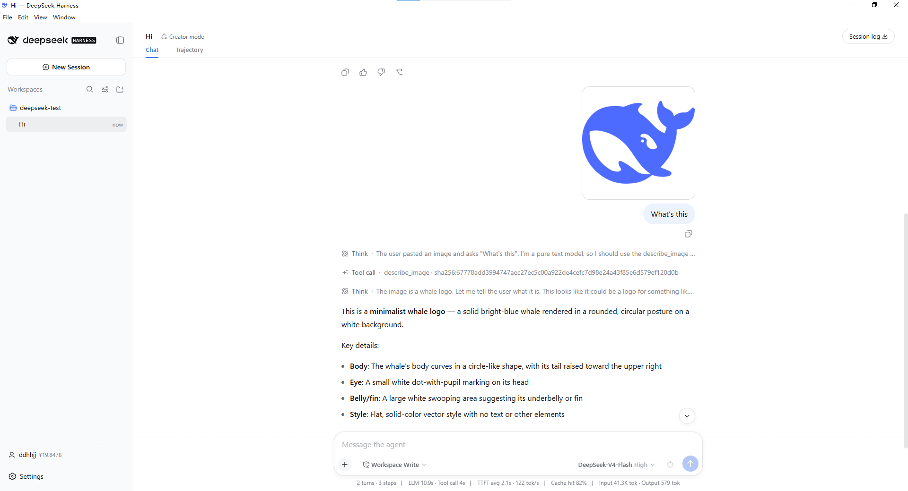

# Dsh-omni-Desktop (DoD)

[中文](README.md) | English

DoD is a desktop distribution of DeepSeek Harness for everyday users. Install it, open the desktop app, choose a workspace, and use the DeepSeek Harness local Web UI without manually preparing Node.js or starting the web service from a terminal.

<h3 align="center">
  <a href="https://dod.penguin.ooo/">Open Download Page</a>
</h3>



## Download

Start from the download page, which collects the current desktop installers and available download sources:

- [Download page](https://dod.penguin.ooo/)

You can also download installers directly from GitHub Releases:

- [GitHub Releases](https://github.com/Prism-Shadow/dsh-omni-desktop/releases)

The release workflow can produce these desktop packages. The exact available files are listed on each Release page.

| Platform | Package |
| --- | --- |
| Windows x64 | `.exe` installer |
| macOS Universal | `.dmg` and `.zip` |
| Linux x64 | `.AppImage` and `.deb` |

If the download page offers GitHub, OSS, or website mirrors, any source is fine; the mirrored files should match the GitHub Release artifacts.

## Install And Start

1. Download the installer for your system from the download page or GitHub Releases.
2. Install the app using your operating system's normal flow.
3. Launch DoD.
4. Choose or create a workspace.
5. Start a new session.

On first launch, the desktop app installs its managed third-party plugins into the user's `web` profile with the official DeepSeek Harness `dsh plugin add` flow. Plugin source is not bundled into the Harness runtime; the plugins are published and updated as public npm packages.

## Daily Use

- **Workspaces**: choose or create workspaces from the sidebar.
- **New sessions**: click `New Session` to start a task.
- **Model selection**: choose the active model from the selector near the input box.
- **Image understanding**: paste or upload an image and let the vision plugin describe it.
- **Session logs**: use `Session log` to download logs for troubleshooting.
- **Settings**: open `Settings` to manage desktop configuration and platform account state.

## Managed Plugins

The desktop app installs these npm plugins on first launch:

| Plugin | npm package | Purpose |
| --- | --- | --- |
| DeepSeek Eyes | [`@prismshadow/dsh-deepseek-eyes`](https://www.npmjs.com/package/@prismshadow/dsh-deepseek-eyes) | Adds the `describe_image` image-understanding tool |
| Penguin LLM Router | [`@prismshadow/dsh-penguin-llm-router`](https://www.npmjs.com/package/@prismshadow/dsh-penguin-llm-router) | Adds platform login, model routing, and account-status integration |

If automatic plugin installation fails, check the desktop log. On Windows it is usually:

```text
%APPDATA%\DeepSeek Harness\desktop.log
```

## FAQ

### Is this the official DeepSeek Harness desktop app?

No. DoD is an independently maintained community desktop distribution. It is not affiliated with, authorized by, endorsed by, or otherwise connected to DeepSeek or the official DeepSeek Harness upstream team.

### How does it relate to DeepSeek Harness?

DeepSeek Harness provides the core agent capabilities, Web UI, session system, and plugin mechanism. DoD tracks the upstream DeepSeek Harness source and applies a desktop distribution overlay for the native shell, installers, release workflows, and desktop-managed plugins.

Upstream project:

- [deepseek-ai/deepseek-harness](https://github.com/deepseek-ai/deepseek-harness)

### Why are the plugins not built directly into Harness?

The managed plugins are third-party npm packages. The desktop app installs them with the official plugin installation flow during first launch. This keeps plugin releases independent from desktop releases while still letting the desktop app pin the versions it installs.

### Can I download from GitHub?

Yes. Desktop packages are published to this repository's [GitHub Releases](https://github.com/Prism-Shadow/dsh-omni-desktop/releases). The download page also links to available GitHub and mirror sources.

## Maintainer Notes

This repository stores desktop distribution files:

- `deepseek-harness/`: upstream DeepSeek Harness submodule
- `overlays/deepseek-harness/`: overlay applied to the upstream checkout
- `overlays/deepseek-harness/apps/desktop/`: desktop shell overlay
- `overlays/deepseek-harness/plugins/`: managed plugin sources
- `scripts/sync-harness.ps1`: syncs upstream and applies the overlay
- `scripts/package-desktop.ps1`: builds a local Windows desktop package
- `.github/workflows/`: desktop build, release, OSS, and npm plugin release workflows

Sync locally:

```powershell
git submodule update --init --recursive
powershell -NoProfile -ExecutionPolicy Bypass -File scripts/sync-harness.ps1 -Force
```

Build a local Windows package:

```powershell
powershell -NoProfile -ExecutionPolicy Bypass -File scripts/package-desktop.ps1
```

The generated installer is printed by the script and usually lives under:

```text
.work/package/<run>/apps/desktop/stage/out/
```

## License And Trademarks

This project is released under the [MIT License](LICENSE).

References to "DeepSeek Harness" identify the upstream open-source project that this desktop distribution works with. The name and related marks belong to their respective owners.

DoD is maintained independently by the community. It does not represent DeepSeek or the upstream DeepSeek Harness team, and it should not be read as an official authorization or recommendation from them.
